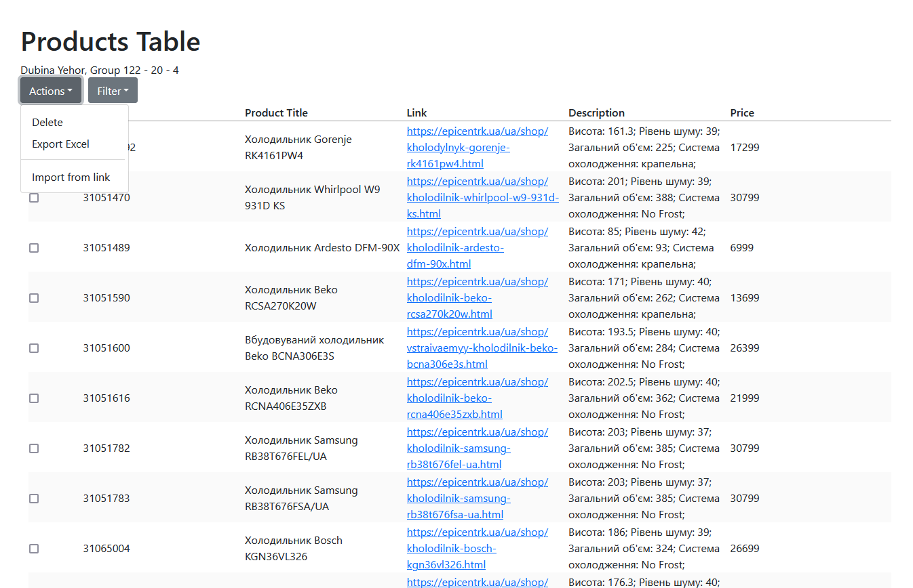
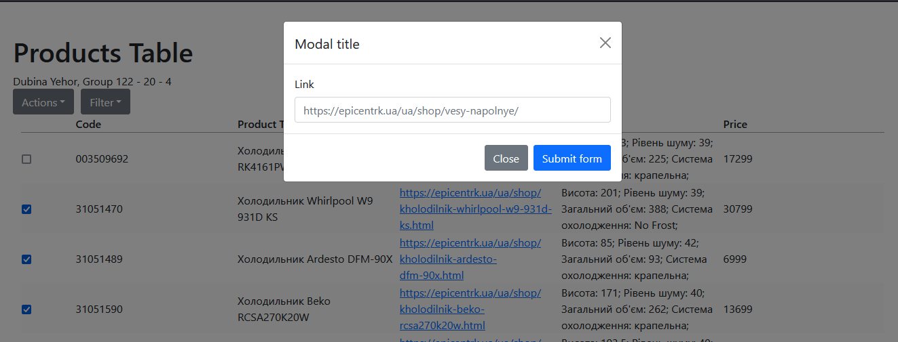

# Spring Application 

<big>Dubina Yehor, 122-20-4</big>

AWS EC2 Instance characterisitc:

* Type t3.micro
* Public IPv4 DNS: **_ec2-13-48-138-18.eu-north-1.compute.amazonaws.com_**
* Public IPv4 address: **_13.48.138.18_**

### Client side address
http://ec2-13-48-138-18.eu-north-1.compute.amazonaws.com:3000/

### REST API Url examples
* http://ec2-13-48-138-18.eu-north-1.compute.amazonaws.com:8080/products/
* http://ec2-13-48-138-18.eu-north-1.compute.amazonaws.com:8080/list/

## Project Structure

**controllers/** 
    
    ListController.java - Запити Excel
    ProductController.java - Запити до товарів 

**entity/** 

    Product.java - Опис таблиці товарів

**repository/** 

    IProductRepository.java - Репозиторий товарів    
    
**services/** 

    ExcelService.java - Обробка Excel запитів
    WebParserService.java - Парсер сайту 

**model/**

    UrlRequest.java - модель запиту

**resources/** 

    application.properties - містить конфігурацію БД

## Description

Проект використовує збірник **Maven**. Сервер написаний з використанням фреймворку Spring. 

Додаток містить ендпоінти, що виконують парсинг сайту **https://epicentrk.ua/** з використанням бібліотеки **Jsoup**.

Окрім цього, додаток має наступний функціонал, що виконаний за архітектурним стилем REST:

* Створення ресурсу
* Видалення ресурсу 
* Отримання ресурсу

Додаток має можливість працювати з **експортом Excel файлів**, що містять данні отримані з **бази даних**.

Додаток массово імпортує данні за вказаним лінком у запиті з відповідних розділів товарів вище зазначенкого сайту, наприклад:

* **https://epicentrk.ua/ua/shop/vesy-napolnye/** 
* **https://epicentrk.ua/ua/shop/setka-svarnaya/** 

### Загальний вигляд застосунку

В випадаючому списку є можливість обрати завантаження Excel даних, або імпортування за посиланням.

### Імпорт даних з **https://epicentrk.ua/**

